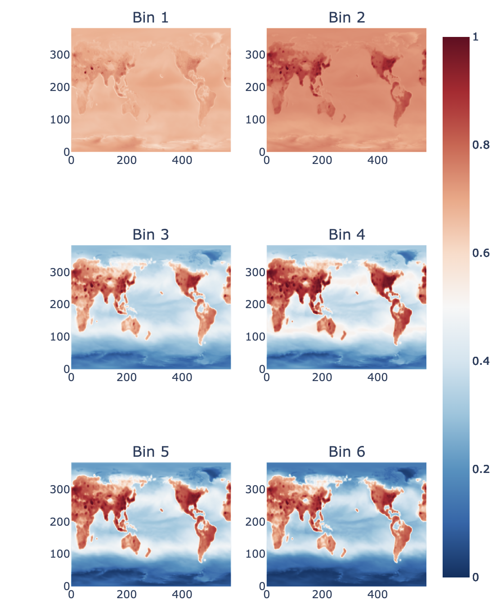

# PINN for Global Airborne Microplastics

This project implements a Physics-Informed Neural Network (PINN) to model the atmospheric transport of airborne microplastics using global simulation data. I use MOZART-4 output from a published study as ground truth, covering 6 particle sizes globally at ~0.1° resolution.

The model is trained to predict 3D mass mixing ratios (MMR) and 2D deposition (dry + wet) fields using a lightweight CNN-based architecture, augmented with a transport-based physics loss.

---

## Model Architecture

The model consists of:

- A shared 3D CNN encoder
    - A 3D MMR head producing a tensor of shape `[B, 6, 48, H, W]`
    - A 2D deposition head producing `[B, 2, H, W]`, appended as the last two "altitude" layers

Final output shape:  
`[B, 6, 50, H, W]` — where 48 is the altitude dim, and last 2 layers are dry & wet deposition respectively.

---

## Loss Functions

### Traditional Loss (MSE with Altitude Weighting)

Let:
- $\hat{M}_{ijk}$ be predicted MMR, $M_{ijk}$ true MMR
- $\hat{D}^{\text{dry}}$, $\hat{D}^{\text{wet}}$ be predicted depositions
- $D^{\text{dry}}$, $D^{\text{wet}}$ true depositions

Total loss:

$$
\mathcal{L}_{\text{total}} = \mathcal{L}_{\text{mmr}} + w_d \cdot \mathcal{L}_{\text{dep}}
$$

$$
\mathcal{L}_{\text{mmr}} = \frac{1}{N} \sum_{ijk} w_i \left( \hat{M}_{ijk} - M_{ijk} \right)^2
$$

$$
\mathcal{L}_{\text{dep}} = \text{MSE}(\hat{D}^{\text{dry}}, D^{\text{dry}}) + \text{MSE}(\hat{D}^{\text{wet}}, D^{\text{wet}})
$$

Where altitude weights $w_i \in [1.0, 2.0]$ scale the surface more heavily than upper levels, since higher altitudes are noisier and less relevant.

---

### Physics Loss (Transport Residual)

The MMR predictions are regularized by the transport PDE:

$$
\underbrace{u \frac{\partial C}{\partial x} + v \frac{\partial C}{\partial y}}_{\text{Advection}} - \underbrace{D \nabla^2 C}_{\text{Diffusion}} + \underbrace{v_s \frac{\partial C}{\partial z}}_{\text{Settling}} = \underbrace{S}_{\text{Source}}
$$

The physics loss is the MSE of this residual:

$$
\mathcal{L}_{\text{phys}} = \left\| u \frac{\partial C}{\partial x} + v \frac{\partial C}{\partial y} - D \nabla^2 C + v_s \frac{\partial C}{\partial z} - S \right\|^2
$$

This encourages physical consistency of the predicted 3D fields with expected transport dynamics. A mass conservation constraint was implemented but not included in training as it did not improve performance.

---

## Ablation Results

| Loss Type              | Physic Loss | MSE ↓     | MAE ↓     | R² ↑      |
|------------------------|-------------|-----------|-----------|-----------|
| Scaled MSE (1 → 0.5)   | ✗          | 0.012809  | 0.082430  | 0.612919  |
|                        | ✓          | 0.013554  | 0.083775  | 0.590148  |
| Scaled MSE (2 → 1)     | ✗          | 0.010552  | 0.074836  | 0.476313  |
|                        | ✓          | 0.011445  | 0.076795  | 0.536649  |
| Normal MSE             | ✗          | 0.012495  | 0.086416  | 0.327048  |
|                        | ✓          | 0.012650  | 0.085926  | 0.352221  |
 

---

## Results Visualization

- **Global surface predictions** for all 6 particle sizes:

  

---

## Notes

- MOZART-4 simulation data is used as pseudo-ground truth.
- All work is done solo.
- PINN improves R² modestly when using surface-focused scaling.
- Transport loss captures spatial structure and encourages physically plausible gradients.

---

## Citation & Credit

Data:  
- Yang, S., Brasseur, G., Walters, S., Lichtig, P. and Cathy (2025). Global atmospheric distribution of microplastics with evidence of low oceanic emissions. npj Climate and Atmospheric Science, 8(1). doi:https://doi.org/10.1038/s41612-025-00914-3.

‌
